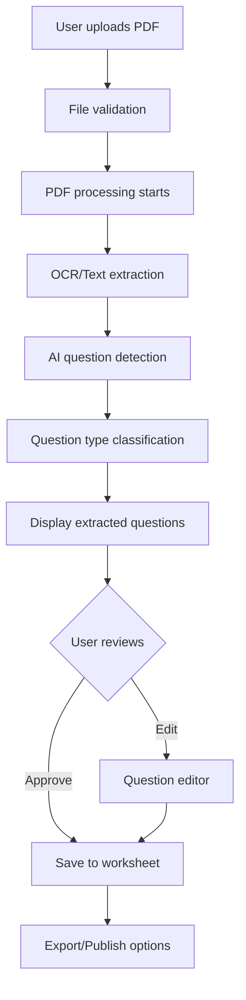

# PDF Import Feature - Project Plan

## Executive Summary

Add the ability to import PDF documents and convert them into interactive exam questions, similar to the existing image import functionality. This feature will use AI-powered OCR and natural language processing to extract questions from PDFs and convert them into editable, interactive formats.

## Feature Overview

### Core Functionality
- Upload PDF files (exams, worksheets, study guides)
- Extract text and questions using OCR technology
- AI-powered question type detection
- Convert to interactive question formats
- Edit and enhance extracted questions
- Export as new interactive worksheets

### User Benefits
- Save hours of manual question entry
- Preserve existing educational materials
- Modernize paper-based assessments
- Create accessible digital versions
- Build question banks from legacy content

## User Stories

### As a Teacher
1. **Upload Legacy Materials**: "I want to upload my existing PDF worksheets so I can convert them to interactive digital formats"
2. **Quick Conversion**: "I want to quickly convert a PDF exam into an online quiz without retyping everything"
3. **Edit Questions**: "I want to review and edit extracted questions to ensure accuracy"
4. **Preserve Formatting**: "I want to maintain question numbering, sections, and difficulty levels from the original"

### As a Content Creator
1. **Bulk Import**: "I want to import multiple PDFs to build a comprehensive question bank"
2. **Categorization**: "I want extracted questions to be automatically categorized by type and topic"
3. **Quality Control**: "I want to preview and validate questions before publishing"

## Technical Requirements

### Frontend Requirements
1. **PDF Upload Component**
   - Drag-and-drop interface
   - File validation (PDF only, size limits)
   - Multi-file support
   - Upload progress indicator

2. **PDF Preview**
   - Display PDF pages
   - Highlight detected questions
   - Page navigation
   - Zoom controls

3. **Question Editor**
   - Side-by-side view (PDF vs extracted)
   - Rich text editing
   - Question type selector
   - Answer configuration
   - Batch editing tools

4. **Export Options**
   - Save as worksheet
   - Export to various formats
   - Share/publish options

### Backend Requirements
1. **PDF Processing**
   - OCR for scanned PDFs
   - Text extraction for digital PDFs
   - Image extraction for diagrams
   - Table detection and parsing

2. **AI Processing**
   - Question detection
   - Question type classification
   - Answer extraction
   - Difficulty assessment
   - Topic categorization

3. **Data Storage**
   - Temporary file storage
   - Processed question storage
   - User workspace management
   - Version control

### API Requirements
```typescript
interface PDFImportAPI {
  // Upload and process PDF
  uploadPDF(file: File): Promise<PDFProcessingJob>
  
  // Get processing status
  getJobStatus(jobId: string): Promise<JobStatus>
  
  // Get extracted questions
  getExtractedQuestions(jobId: string): Promise<ExtractedQuestion[]>
  
  // Save edited questions
  saveQuestions(questions: Question[]): Promise<Worksheet>
  
  // Export functions
  exportAsWorksheet(jobId: string, options: ExportOptions): Promise<Worksheet>
}
```

## User Flow



## Feature Components

### 1. PDF Upload Component
```typescript
interface PDFUploadProps {
  onUpload: (files: File[]) => void
  maxFiles?: number
  maxSizePerFile?: number // in MB
  acceptedFormats?: string[]
}
```

### 2. PDF Viewer Component
```typescript
interface PDFViewerProps {
  file: File | string // File object or URL
  highlightRegions?: Region[]
  onRegionClick?: (region: Region) => void
  currentPage?: number
  zoom?: number
}
```

### 3. Question Extraction Panel
```typescript
interface ExtractionPanelProps {
  extractedQuestions: ExtractedQuestion[]
  onEdit: (question: ExtractedQuestion) => void
  onDelete: (questionId: string) => void
  onTypeChange: (questionId: string, type: QuestionType) => void
  onBatchAction: (action: BatchAction) => void
}
```

### 4. Question Editor Modal
```typescript
interface QuestionEditorProps {
  question: ExtractedQuestion
  pdfContext?: PDFContext // Show source PDF section
  onSave: (question: Question) => void
  onCancel: () => void
}
```

## Implementation Plan

### Phase 1: Core Infrastructure (Week 1)
- [ ] Set up PDF.js for PDF rendering
- [ ] Create upload component with drag-and-drop
- [ ] Implement file validation and error handling
- [ ] Create basic PDF viewer component
- [ ] Set up processing queue system

### Phase 2: PDF Processing (Week 2)
- [ ] Integrate OCR library (Tesseract.js)
- [ ] Implement text extraction for digital PDFs
- [ ] Create question detection algorithm
- [ ] Build question type classifier
- [ ] Extract question metadata (points, difficulty)

### Phase 3: User Interface (Week 3)
- [ ] Build question review interface
- [ ] Create question editor component
- [ ] Implement batch operations
- [ ] Add preview functionality
- [ ] Create export options UI

### Phase 4: AI Integration (Week 4)
- [ ] Integrate AI for question enhancement
- [ ] Implement answer extraction
- [ ] Add difficulty assessment
- [ ] Create topic categorization
- [ ] Build quality scoring

### Phase 5: Polish & Deploy (Week 5)
- [ ] Add progress indicators
- [ ] Implement error recovery
- [ ] Create help documentation
- [ ] Add accessibility features
- [ ] Performance optimization
- [ ] Deploy to production

## Technical Stack

### Frontend Libraries
```json
{
  "pdf.js": "^3.11.174",
  "react-pdf": "^7.7.0",
  "tesseract.js": "^5.0.4",
  "react-dropzone": "^14.2.3",
  "pdfjs-dist": "^3.11.174"
}
```

### Processing Pipeline
1. **PDF.js**: Render and extract text from PDFs
2. **Tesseract.js**: OCR for scanned documents
3. **Natural Language Processing**: Question detection
4. **Custom AI Models**: Question type classification

### Data Models
```typescript
interface ExtractedQuestion {
  id: string
  sourcePageNumber: number
  sourceBoundingBox: BoundingBox
  rawText: string
  processedText: string
  detectedType: QuestionType
  confidence: number
  suggestedAnswers?: string[]
  metadata: {
    points?: number
    difficulty?: Difficulty
    topic?: string
    subtopic?: string
  }
}

interface PDFProcessingJob {
  id: string
  status: 'pending' | 'processing' | 'completed' | 'failed'
  progress: number
  totalPages: number
  processedPages: number
  extractedQuestions: ExtractedQuestion[]
  errors?: ProcessingError[]
  startedAt: Date
  completedAt?: Date
}
```

## Success Metrics

### Performance Metrics
- PDF processing time < 30 seconds for 10-page document
- OCR accuracy > 95% for clear text
- Question detection accuracy > 90%
- Question type classification accuracy > 85%

### User Experience Metrics
- Time to first question displayed < 5 seconds
- User satisfaction rating > 4.5/5
- Question editing time reduced by 70%
- Successful conversion rate > 80%

## Risk Mitigation

### Technical Risks
1. **Poor PDF Quality**
   - Solution: Provide image enhancement tools
   - Fallback: Manual question entry option

2. **Complex Layouts**
   - Solution: AI-powered layout analysis
   - Fallback: Region selection tool

3. **Large File Sizes**
   - Solution: Streaming processing
   - Fallback: Page-by-page processing

### User Experience Risks
1. **Inaccurate Extraction**
   - Solution: Easy editing tools
   - Mitigation: Confidence indicators

2. **Processing Time**
   - Solution: Progress indicators
   - Mitigation: Background processing

## Future Enhancements

### Version 2.0
- Batch processing multiple PDFs
- Template recognition
- Answer key detection
- Automatic grading rubric extraction

### Version 3.0
- Handwriting recognition
- Multi-language support
- Collaborative editing
- Version history

## Dependencies

### Required Services
- File storage (Supabase Storage)
- Background job processing
- AI/ML services for enhancement
- CDN for PDF delivery

### Security Considerations
- File type validation
- Virus scanning
- Size limitations
- User quota management
- GDPR compliance for data processing

---

*This feature plan provides a comprehensive roadmap for implementing PDF import functionality in Quiz Wiz Worksheet Genie.*